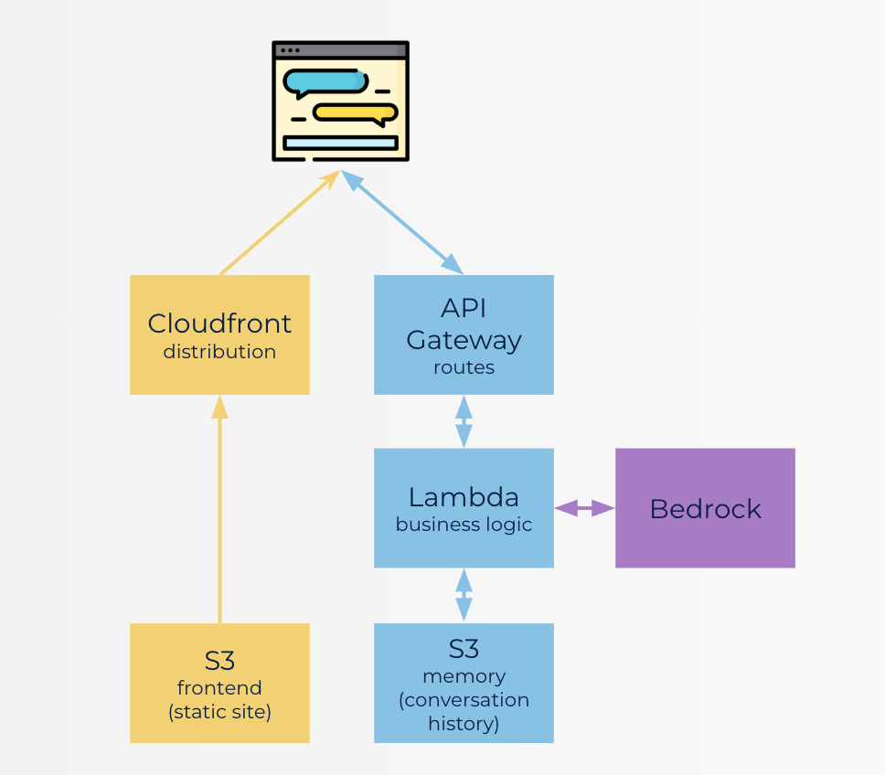

# Portfolio AI Assistant (Jarvis)

**An AI-powered chatbot that acts as my digital assistant** — answering questions about my skills, experience, and background.

Purpose of building this project was to experience the best practicies used in teh industry to deploy modern AI systems at scale. Built with **Next.js (frontend)** and **FastAPI (backend)**, deployed on **AWS Lambda, API Gateway, S3, and CloudFront**, with infrastructure managed via **Terraform** and CI/CD powered by **GitHub Actions**. 

---

## 🔗 Live Demo

🌐 [Access the live demo here](https://d2n4uih20h4m0y.cloudfront.net)

☕ Heads-up: the live demo sometimes takes a budget-induced coffee break (AWS caps).

---

## Architecture Diagram


## 🌟 Highlights

* Conversational AI trained with my professional context (facts, summary, LinkedIn PDF, and style).
* Persistent memory (local in dev, S3 in prod).
* Multi-environment deployments (dev, test, prod).
* AI powered by **AWS Bedrock (Nova models)**.
* Infrastructure managed with **Terraform (IaC)**.
* Automated deployments via **GitHub Actions** with OIDC.

---

## 🛠️ Tech Stack

* **Frontend**: Next.js 15, React, Tailwind CSS
* **Backend**: FastAPI, Python 3.12, boto3
* **AI**: AWS Bedrock (Nova family)
* **Infrastructure**: Terraform, AWS (Lambda, API Gateway, S3, CloudFront, DynamoDB)
* **CI/CD**: GitHub Actions
* **Dev Tools**: `uv` (Python package manager), Docker, npm

---

## 📂 Project Structure

```
twin/
├── backend/        # FastAPI backend (Lambda ready)
├── frontend/       # Next.js frontend
├── memory/         # Local conversation storage
├── terraform/      # IaC with Terraform
├── scripts/        # Deploy/destroy automation scripts
```

---

## ⚡ Getting Started (Mac)

### 1. Clone the repo

```bash
git clone https://github.com/YOUR_USERNAME/digital-twin.git
cd digital-twin
```

### 2. Backend setup

```bash
cd backend
uv init --bare
uv python pin 3.12
uv add -r requirements.txt
uv run uvicorn server:app --reload
```

Backend runs at: [http://localhost:8000](http://localhost:8000)

### 3. Frontend setup

```bash
cd frontend
npm install
npm run dev
```

Frontend runs at: [http://localhost:3000](http://localhost:3000)

---

## ☁️ Deploying to AWS

1. Configure AWS credentials:

   ```bash
   aws configure
   ```
2. Deploy with script:

   ```bash
   ./scripts/deploy.sh dev
   ```
3. Destroy environment when done:

   ```bash
   ./scripts/destroy.sh dev
   ```

Environments supported: `dev`, `test`, `prod`.

---

## 🔄 CI/CD with GitHub Actions

* Deploys automatically on push to `main`.
* Manual triggers for `dev`, `test`, and `prod`.
* Uses Terraform S3 backend + DynamoDB locks.
* Authenticates with AWS via OIDC IAM role (no long-lived keys).

---

## 🧠 AI Models

Powered by **Amazon Bedrock Nova** family:

* **Micro** → fastest, lowest cost
* **Lite** → balanced (default)
* **Pro** → most capable, higher cost

Set model via environment variable:

```bash
export BEDROCK_MODEL_ID=amazon.nova-lite-v1:0
```

---

## 📊 Monitoring

* **CloudWatch**: Lambda & Bedrock metrics, dashboards.
* **Cost Monitoring**: Billing alerts via AWS Budgets.

---

## Development in process

* Provide the agent with more tools to access owner's info (Github repo access, Blog post access, Twitter access and can  be many more).
*  Equip the agent with PUSHOVER Notification tool through which it can send notification/email about the user's query that it could not answer.